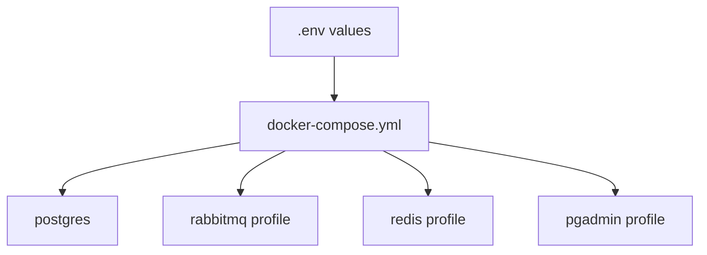

# docker architecture

## Mapa interno

```text
docker/
|-- docs/
|-- docker-compose.yml
|-- README.md
`-- CHANGELOG.md
```

## Servicios definidos

| Servicio | Tipo | Perfil |
| --- | --- | --- |
| `postgres` | base de datos relacional | default |
| `rabbitmq` | mensajeria | `messaging` |
| `redis` | cache | `cache` |
| `pgadmin` | herramienta visual | `tools` |

## Diagrama local



## Decisiones estructurales visibles

- Hay un core minimo y perfiles opcionales.
- Los servicios se exponen por puertos locales estables.
- La topologia privilegia desarrollo local y debugging visual.
