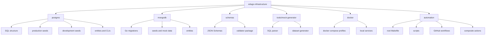

# Architecture

## Vista de repositorio

El repositorio se organiza como una plataforma de infraestructura compartida. Cada modulo encapsula un tipo de activo distinto: SQL, documentos Mongo, contratos JSON, generacion de dataset o runtime local.

## Capas observadas

| Capa | Superficies |
| --- | --- |
| Datos relacionales | `postgres` |
| Datos documentales | `mongodb` |
| Contratos | `schemas` |
| Runtime local | `docker` |
| Generacion auxiliar | `tools/mock-generator` |
| Calidad y entrega | `Makefile`, `scripts`, `.github` |

## Regla de modelado usada en esta documentacion

- Primero se documenta el proceso interno del modulo.
- Luego se describe su arquitectura local.
- La integracion entre modulos queda diferida para fase 2.
