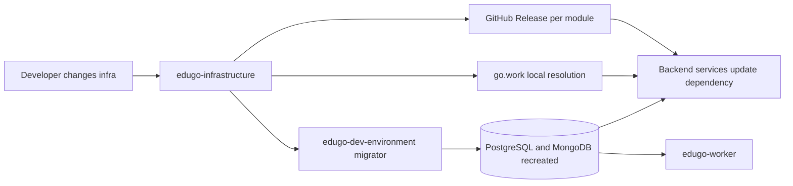

# Ecosystem Integration

Esta es la documentacion de fase 2 para `edugo-infrastructure`.

Fuentes usadas en esta fase:

- `ecosistema.md`: `/Users/jhoanmedina/source/EduGo/Common/ecosistema.md`
- codigo y documentacion local de este repositorio
- dependencias e imports observados en repos vecinos del ecosistema

## Rol de `edugo-infrastructure` dentro del ecosistema

En el ecosistema EduGo, este repositorio cumple cuatro funciones distintas:

1. fuente de verdad del modelo relacional y documental
2. proveedor de tipos Go compartidos por servicios backend
3. proveedor de seeds y datasets de arranque para ambiente de desarrollo
4. proveedor de contratos JSON Schema para eventos versionados

## Reglas del ecosistema que afectan este repo

Segun `ecosistema.md`, estas reglas impactan directamente a `edugo-infrastructure`:

- cambios en librerias compartidas requieren GitHub Release
- en local, `go.work` resuelve los modulos sin release
- los cambios de base de datos se hacen editando los `CREATE` completos en este repo
- la recreacion de base y aplicacion de migraciones se considera parte de `edugo-dev-environment`

## Integracion por modulo

| Modulo | Consumidores observados | Tipo de integracion |
| --- | --- | --- |
| `postgres` | `edugo-api-iam-platform`, `edugo-api-admin-new`, `edugo-api-mobile-new`, `edugo-dev-environment/migrator` | entities, estructura SQL embebida, seeds |
| `mongodb` | `edugo-api-mobile-new`, `edugo-worker`, `edugo-dev-environment/migrator` | entities, migraciones Go, setup de tests |
| `schemas` | sin consumo directo observado en los repos escaneados | capa de contratos disponible para productores/consumidores |
| `tools/mock-generator` | sin consumo externo directo observado; si aparece en `go.work` | herramienta auxiliar interna |
| `docker` | uso local aislado dentro de este repo | soporte local, no orquestador canonico del ecosistema |

## Flujo de cambio canonico en el ecosistema

## Integracion con `go.work`

El workspace local en `/Users/jhoanmedina/source/EduGo/EduBack/go.work` incluye:

- `./edugo-infrastructure/postgres`
- `./edugo-infrastructure/mongodb`
- `./edugo-infrastructure/schemas`
- `./edugo-infrastructure/tools/mock-generator`

Eso confirma que, en desarrollo local, los servicios y herramientas del ecosistema pueden resolver estos modulos sin esperar una release publicada.

## Integracion con `edugo-dev-environment`

La integracion mas estructural del repo no es con una API sino con el migrador del ambiente:

- `edugo-dev-environment/migrator/cmd/main.go` importa `postgres/migrations`
- importa `postgres/seeds`
- importa `mongodb/migrations`

Eso convierte a `edugo-dev-environment` en el ejecutor canonico de la reconstruccion de datos del ecosistema.

## Integracion interna entre modulos de este repo

### `postgres` <-> `mongodb`

La integracion interna mas fuerte ocurre por identidad de negocio compartida:

- `material_id` aparece en ambos lados
- `assessment` en PostgreSQL referencia `mongo_document_id`
- los seeds de Mongo declaran alineacion con IDs de materiales sembrados en Postgres

No existe un modulo formal de composicion entre ambos dentro de este repo; la alineacion es por convencion de datos y por consumo desde servicios del ecosistema.

### `postgres` <-> `schemas`

Los schemas de eventos usan UUIDs y entidades cuyo origen natural esta en PostgreSQL, por ejemplo:

- `material_id`
- `school_id`
- `student_id`
- `membership_id`

La integracion es semantica: `schemas` publica contratos cuyo payload se apoya en identidades y recursos definidos relacionalmente.

### `mongodb` <-> `schemas`

La integracion es semantica y de proceso:

- eventos como `material.uploaded` y `assessment.generated` describen estados que terminan persistidos o derivados en MongoDB
- `assessment.generated` incluye `mongo_document_id`, puente explicito hacia documentos Mongo

### `tools/mock-generator` <-> `postgres`

La integracion aqui es directa por codigo:

- `tools/mock-generator` genera codigo que importa `postgres/entities`
- su insumo son scripts SQL
- su salida apunta a datasets Go alineados con el modelo relacional

### `docker` <-> `postgres` y `mongodb`

La superficie `docker/` sirve como soporte local para aislar trabajo de infraestructura. No reemplaza el rol de `edugo-dev-environment`, pero ayuda a validar este repo sin arrancar todo el ecosistema.

## Hallazgos importantes de alineacion

`ecosistema.md` posiciona correctamente a este repo como fuente de verdad, pero su resumen estructural no coincide del todo con el estado actual del codigo.

Desalineaciones observadas:

- el ecosistema resume roles/permisos bajo `auth`, pero en este repo viven en `iam`
- el ecosistema mezcla tablas UI con `content`, pero aqui viven en `ui_config`
- el ecosistema lista colecciones Mongo historicas que hoy no estan activas en `mongodb/migrations/embed.go`

Por eso, en esta fase 2 se usa `ecosistema.md` para entender relaciones entre repos y reglas de trabajo, pero la topologia exacta de `edugo-infrastructure` se sigue leyendo desde este repo.

## Implicancia operativa

Cuando cambias este repo, el impacto ecosistemico esperado es:

1. actualizar el modulo afectado aqui
2. validar localmente via `go.work` o via `edugo-dev-environment`
3. publicar release del modulo si el cambio debe ser consumido por otros servicios
4. actualizar dependencias en APIs, worker o migrator segun corresponda
