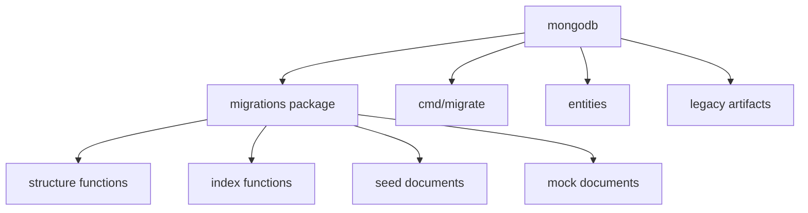

# mongodb architecture

## Mapa interno

```text
mongodb/
|-- cmd/
|   `-- migrate/
|-- docs/
|-- entities/
|-- migrations/
|   |-- _deprecated/
|   |-- cmd/
|   |-- embed.go
|   |-- mock_data.go
|   `-- seeds.go
|-- seeds/
|   `-- development/
|-- Makefile
|-- README.md
`-- CHANGELOG.md
```

## Activos principales

| Activo | Funcion |
| --- | --- |
| `migrations/embed.go` | define structure, constraints y API publica del modulo |
| `migrations/seeds.go` | seeds canonicos embebidos |
| `migrations/mock_data.go` | mock data para desarrollo y pruebas |
| `entities/*.go` | models Go de las collections activas |
| `cmd/migrate/migrate.go` | CLI de estado y force |

## Diagrama local



## Decisiones estructurales visibles

- La estructura activa esta colapsada en un solo paquete Go.
- Las collections activas son pocas y estan orientadas a artefactos del worker.
- El modulo mantiene restos historicos, pero la documentacion nueva los trata como secundarios.
