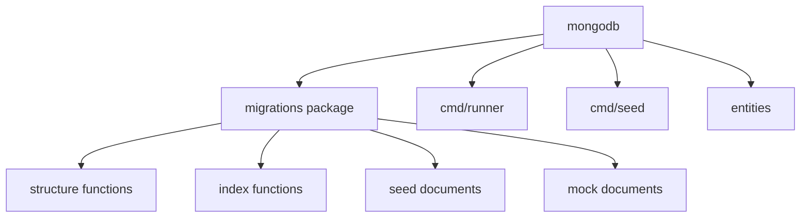

# mongodb architecture

## Mapa interno

```text
mongodb/
|-- cmd/
|   |-- runner/
|   `-- seed/
|-- docs/
|-- entities/
|-- internal/
|   `-- mongodbutil/
|-- migrations/
|   |-- embed.go
|   |-- mock_data.go
|   `-- seeds.go
|-- Makefile
|-- README.md
`-- CHANGELOG.md
```

## Activos principales

| Activo | Funcion |
| --- | --- |
| `migrations/embed.go` | define structure, constraints y API publica del modulo |
| `migrations/seeds.go` | seeds canonicos embebidos |
| `migrations/mock_data.go` | mock data para desarrollo y pruebas |
| `entities/*.go` | models Go de las collections activas |
| `internal/mongodbutil` | utilidad compartida para construir MongoDB URI desde variables de entorno |
| `cmd/runner` | ejecuta estructura + constraints embebidos (`all`, `structure`, `constraints`) |
| `cmd/seed` | ejecuta seeds embebidos (`all`, `canonical`, `mock`) |

## Diagrama local



## Decisiones estructurales visibles

- La estructura activa esta colapsada en un solo paquete Go.
- Las collections activas son pocas y estan orientadas a artefactos del worker.
