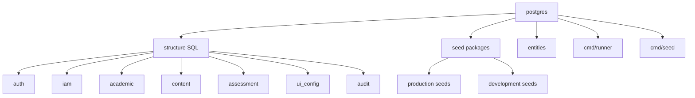

# postgres architecture

## Mapa interno

```text
postgres/
|-- cmd/
|   |-- runner/
|   `-- seed/
|-- docs/
|-- entities/
|-- internal/
|   |-- dbutil/
|   `-- sqlutil/
|-- migrations/
|   `-- structure/
|-- seeds/
|   |-- development/
|   `-- production/
|-- Makefile
|-- README.md
`-- CHANGELOG.md
```

## Activos principales

| Activo | Funcion |
| --- | --- |
| `migrations/structure/*.sql` | define schemas, tablas, funciones, vistas y FK |
| `migrations/embed.go` | embebe y ejecuta SQL de estructura |
| `migrations/version.go` | constante `SchemaVersion` y calculo de hash de archivos |
| `seeds/embed.go` | embebe y ejecuta seeds de produccion y desarrollo |
| `seeds/version.go` | calculo de hash combinado de seeds (production + development) |
| `entities/*.go` | representa tablas como structs Go |
| `internal/dbutil` | utilidad compartida para construir DB URL desde variables de entorno |
| `internal/sqlutil` | utilidad compartida para detectar SQL vacio o de solo comentarios |
| `cmd/runner` | ejecuta estructura + seeds embebidos (`all`, `structure`, `production-seeds`, `development-seeds`) |
| `cmd/seed` | ejecuta solo seeds embebidos (`all`, `production`, `development`) |

## Diagrama local



## Decisiones estructurales visibles

- El schema se ordena por prefijos numericos y por domain.
- Los seeds se separan entre canonicos y de desarrollo.
- Los entities viven como reflejo tipado del schema.
- Las capacidades programaticas embebidas son mas confiables que algunos scripts heredados de shell o Makefile.
