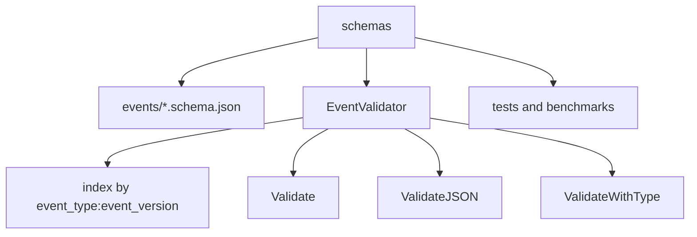

# schemas architecture

## Mapa interno

```text
schemas/
|-- docs/
|-- events/
|-- validator.go
|-- example_test.go
|-- validator_comprehensive_test.go
|-- Makefile
|-- README.md
`-- CHANGELOG.md
```

## Activos principales

| Activo | Funcion |
| --- | --- |
| `events/*.schema.json` | contratos versionados |
| `validator.go` | carga, indexa y valida schemas |
| `*_test.go` | valida casos felices, errores y performance |

## Diagrama local



## Decisiones estructurales visibles

- Todo vive en un solo paquete.
- La extensibilidad depende de agregar archivos JSON siguiendo la convencion de nombre.
- La verificacion del modulo descansa mas en tests que en capas de runtime adicionales.
