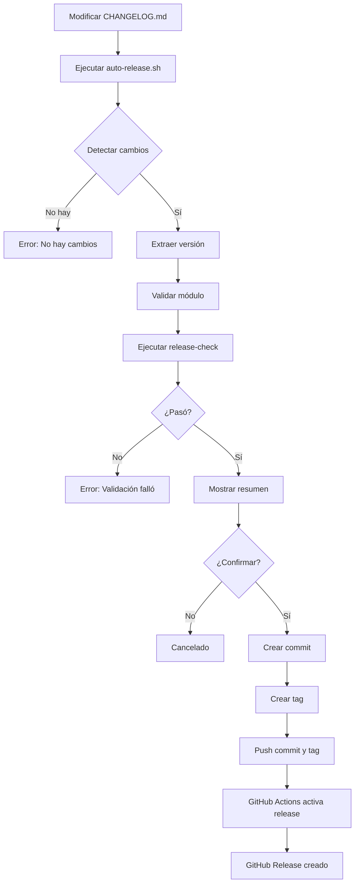

# Auto-Release Script

Script automatizado para gestionar releases de módulos en el monorepo `edugo-infrastructure`.

## 🎯 Propósito

Este script automatiza el proceso de release de módulos individuales:

1. **Detecta** CHANGELOGs modificados (sin commitear)
2. **Extrae** la versión más reciente de cada CHANGELOG
3. **Valida** módulos, versiones y ejecuta `release-check`
4. **Crea** commits y tags automáticamente
5. **Pushea** al remote para activar GitHub Actions release workflow

## 📋 Requisitos Previos

- Estar en un repositorio Git válido
- Tener cambios **sin commitear** en uno o más archivos `CHANGELOG.md`
- Los CHANGELOGs deben seguir el formato estándar con sección `[Unreleased]`
- Remote configurado (default: `origin`)

## 🚀 Uso Básico

### Caso 1: Un Solo Módulo

```bash
# 1. Modifica el CHANGELOG del módulo (SIN commitear)
vim postgres/CHANGELOG.md

# 2. Ejecuta el script
make auto-release
# O directamente: ./scripts/auto-release.sh

# El script detectará automáticamente el módulo y la versión
```

### Caso 2: Múltiples Módulos

```bash
# 1. Modifica varios CHANGELOGs (SIN commitear)
vim postgres/CHANGELOG.md
vim mongodb/CHANGELOG.md

# 2. Procesar todos automáticamente
make auto-release-all
# O directamente: ./scripts/auto-release.sh --all

# O seleccionar interactivamente
make auto-release
```

### Caso 3: Módulos Específicos

```bash
# Procesar solo postgres y mongodb
./scripts/auto-release.sh postgres mongodb
```

## 🎛️ Opciones

### Comandos Make (Recomendado)

| Comando | Descripción |
|---------|-------------|
| `make auto-release` | Release interactivo (detecta módulos modificados) |
| `make auto-release-all` | Procesar todos los módulos modificados |
| `make auto-release-dry-run` | Simular sin hacer cambios (con verbose) |
| `make auto-release-help` | Mostrar ayuda del script |

### Opciones del Script

| Opción | Descripción |
|--------|-------------|
| `-h, --help` | Mostrar ayuda completa |
| `-d, --dry-run` | Simular sin hacer cambios reales |
| `-v, --verbose` | Modo verbose para debugging |
| `-a, --all` | Procesar todos los módulos modificados |
| `-r, --remote NAME` | Especificar remote (default: origin) |
| `-y, --yes` | Auto-confirmar (modo no interactivo) |

## 📝 Ejemplos Completos

### Ejemplo 1: Dry-Run con Verbose

Útil para ver qué haría el script sin hacer cambios:

```bash
make auto-release-dry-run
# O directamente: ./scripts/auto-release.sh --dry-run --verbose
```

**Salida esperada:**
```
[VERBOSE] Iniciando auto-release script...
[VERBOSE] Directorio raíz: /path/to/edugo-infrastructure
[VERBOSE] Verificando repositorio Git...
[VERBOSE] ✓ Repositorio Git válido
[VERBOSE] Detectando CHANGELOGs modificados...
[VERBOSE] Archivos modificados encontrados:
  - postgres/CHANGELOG.md
[INFO] Detectados 1 módulo(s) con cambios en CHANGELOG

━━━━━━━━━━━━━━━━━━━━━━━━━━━━━━━━━━━━━━━━━━━━━━━━━━━━
Módulo 1/1: postgres
━━━━━━━━━━━━━━━━━━━━━━━━━━━━━━━━━━━━━━━━━━━━━━━━━━━━

[VERBOSE] Extrayendo versión de postgres/CHANGELOG.md
[VERBOSE] Versión encontrada: 0.77.1
[VERBOSE] Validando módulo 'postgres' versión '0.77.1'...
[VERBOSE] ✓ Módulo 'postgres' validado
[VERBOSE] Ejecutando release-check para 'postgres'...
[WARNING] [DRY-RUN] Se ejecutaría: make -C postgres release-check
[VERBOSE] ✓ release-check pasó para 'postgres'
  ✓ Versión: 0.77.1
  ✓ Tag: postgres/v0.77.1
  ✓ Validaciones: PASSED

━━━━━━━━━━━━━━━━━━━━━━━━━━━━━━━━━━━━━━━━━━━━━━━━━━━━
RESUMEN DE RELEASES
━━━━━━━━━━━━━━━━━━━━━━━━━━━━━━━━━━━━━━━━━━━━━━━━━━━━

Se crearán los siguientes releases:
  1. postgres/v0.77.1

¿Continuar con los commits, tags y push? (y/N):
```

### Ejemplo 2: Release de Múltiples Módulos

```bash
# Modificar varios CHANGELOGs
vim postgres/CHANGELOG.md    # Agregar versión 0.77.1
vim mongodb/CHANGELOG.md     # Agregar versión 0.58.0
vim schemas/CHANGELOG.md     # Agregar versión 0.52.0

# Ejecutar con --all para procesar todos
./scripts/auto-release.sh --all --verbose
```

**Salida esperada:**
```
[INFO] Detectados 3 módulo(s) con cambios en CHANGELOG

━━━━━━━━━━━━━━━━━━━━━━━━━━━━━━━━━━━━━━━━━━━━━━━━━━━━
Módulo 1/3: postgres
━━━━━━━━━━━━━━━━━━━━━━━━━━━━━━━━━━━━━━━━━━━━━━━━━━━━

  ✓ Versión: 0.77.1
  ✓ Tag: postgres/v0.77.1
  ✓ Validaciones: PASSED

━━━━━━━━━━━━━━━━━━━━━━━━━━━━━━━━━━━━━━━━━━━━━━━━━━━━
Módulo 2/3: mongodb
━━━━━━━━━━━━━━━━━━━━━━━━━━━━━━━━━━━━━━━━━━━━━━━━━━━━

  ✓ Versión: 0.58.0
  ✓ Tag: mongodb/v0.58.0
  ✓ Validaciones: PASSED

━━━━━━━━━━━━━━━━━━━━━━━━━━━━━━━━━━━━━━━━━━━━━━━━━━━━
Módulo 3/3: schemas
━━━━━━━━━━━━━━━━━━━━━━━━━━━━━━━━━━━━━━━━━━━━━━━━━━━━

  ✓ Versión: 0.52.0
  ✓ Tag: schemas/v0.52.0
  ✓ Validaciones: PASSED

━━━━━━━━━━━━━━━━━━━━━━━━━━━━━━━━━━━━━━━━━━━━━━━━━━━━
RESUMEN DE RELEASES
━━━━━━━━━━━━━━━━━━━━━━━━━━━━━━━━━━━━━━━━━━━━━━━━━━━━

Se crearán los siguientes releases:
  1. postgres/v0.77.1
  2. mongodb/v0.58.0
  3. schemas/v0.52.0

¿Continuar con los commits, tags y push? (y/N): y

[INFO] Procesando postgres v0.77.1...
[SUCCESS] ✓ Commit y tag creados para postgres
[INFO] Procesando mongodb v0.58.0...
[SUCCESS] ✓ Commit y tag creados para mongodb
[INFO] Procesando schemas v0.52.0...
[SUCCESS] ✓ Commit y tag creados para schemas
[INFO] Haciendo push de commits...
[INFO] Haciendo push de tags...
[SUCCESS] ✓ Push completado

[SUCCESS] Releases completados exitosamente!

Los siguientes workflows de GitHub Actions se activarán:
  • postgres/v0.77.1 → https://github.com/EduGoGroup/edugo-infrastructure/actions
  • mongodb/v0.58.0 → https://github.com/EduGoGroup/edugo-infrastructure/actions
  • schemas/v0.52.0 → https://github.com/EduGoGroup/edugo-infrastructure/actions
```

### Ejemplo 3: Modo No Interactivo (CI/CD)

```bash
# Para uso en scripts o CI/CD
./scripts/auto-release.sh --all --yes
```

### Ejemplo 4: Selección Interactiva

```bash
./scripts/auto-release.sh

# Si hay múltiples módulos modificados, el script preguntará:
# ¿Procesar todos los módulos? (y/N): n
# 
# Especifica los números de los módulos a procesar (separados por espacio):
# > 1 3
```

## 📐 Formato del CHANGELOG

El script espera que los CHANGELOGs sigan este formato:

```markdown
# Changelog

## [Unreleased]

## [0.77.1] - 2026-03-29
### Changed
- fix seeds structure

## [0.77.0] - 2026-03-29
### Changed
- fix seeds structure
```

**Importante:**
- Debe haber una sección `## [Unreleased]`
- La versión más reciente debe estar **inmediatamente después** de `[Unreleased]`
- El formato de versión debe ser `[X.Y.Z]` (semver sin la `v`)

## 🔄 Flujo Completo



## 🛡️ Validaciones

El script realiza las siguientes validaciones:

1. ✅ **Repositorio Git válido**
2. ✅ **Remote existe** (default: origin)
3. ✅ **CHANGELOGs modificados** sin commitear
4. ✅ **Formato de versión válido** (X.Y.Z)
5. ✅ **Módulo existe** en el proyecto
6. ✅ **Tag no existe** previamente
7. ✅ **release-check pasa** (si existe el target en Makefile)

## 🔧 Integración con GitHub Actions

El script crea tags con el formato `<módulo>/v<versión>` que activan el workflow `.github/workflows/release.yml`:

```yaml
on:
  push:
    tags:
      - '*/v*'
```

**Ejemplo de tags creados:**
- `postgres/v0.77.1`
- `mongodb/v0.58.0`
- `schemas/v0.52.0`

Cada tag activa automáticamente:
1. Validación del módulo (`make release-check`)
2. Extracción de notas del CHANGELOG
3. Creación del GitHub Release
4. Publicación del release

## 🐛 Troubleshooting

### Error: "No hay CHANGELOGs modificados"

**Causa:** No hay cambios sin commitear en archivos CHANGELOG.md

**Solución:**
```bash
# Verifica que tienes cambios
git status

# Asegúrate de NO haber commiteado el CHANGELOG
git diff postgres/CHANGELOG.md
```

### Error: "No se pudo extraer versión"

**Causa:** El CHANGELOG no tiene el formato correcto

**Solución:**
```bash
# Verifica que hay una sección [Unreleased] seguida de una versión
head -20 postgres/CHANGELOG.md

# Debe verse así:
# ## [Unreleased]
# 
# ## [0.77.1] - 2026-03-29
```

### Error: "El tag 'postgres/v0.77.1' ya existe"

**Causa:** Ya existe un release con esa versión

**Solución:**
```bash
# Verifica los tags existentes
git tag -l "postgres/*"

# Incrementa la versión en el CHANGELOG
vim postgres/CHANGELOG.md
```

### Error: "release-check falló"

**Causa:** El módulo no pasa las validaciones de release

**Solución:**
```bash
# Ejecuta release-check manualmente para ver el error
make -C postgres release-check

# Corrige los errores y vuelve a intentar
```

## 💡 Tips y Mejores Prácticas

### 1. Usa Dry-Run Primero

Siempre ejecuta con `--dry-run` primero para verificar:

```bash
./scripts/auto-release.sh --dry-run --verbose
```

### 2. Verifica el CHANGELOG Antes

```bash
# Ver los cambios que vas a commitear
git diff postgres/CHANGELOG.md
```

### 3. Un Módulo a la Vez (Recomendado)

Para mayor control, procesa un módulo a la vez:

```bash
./scripts/auto-release.sh postgres
```

### 4. Múltiples Módulos con Cuidado

Si procesas múltiples módulos, asegúrate de que todos estén listos:

```bash
# Verifica cada módulo individualmente primero
make -C postgres release-check
make -C mongodb release-check

# Luego procesa todos
./scripts/auto-release.sh --all
```

### 5. Modo Verbose para Debugging

Si algo falla, usa verbose para ver detalles:

```bash
./scripts/auto-release.sh --verbose
```

## 🔗 Referencias

- [Documentación de Releases](../docs/releasing.md)
- [GitHub Actions Workflow](../.github/workflows/release.yml)
- [Script de Release Manual](./module-release.sh)

## 📞 Soporte

Si encuentras problemas:

1. Ejecuta con `--dry-run --verbose` para ver detalles
2. Verifica que el CHANGELOG tiene el formato correcto
3. Asegúrate de que `release-check` pasa manualmente
4. Revisa los logs de GitHub Actions si el push fue exitoso

## 🎓 Ejemplo Completo Paso a Paso

```bash
# 1. Verifica el estado actual
git status
# Output: On branch main, nothing to commit, working tree clean

# 2. Modifica el CHANGELOG
vim postgres/CHANGELOG.md
# Agrega la nueva versión después de [Unreleased]

# 3. Verifica los cambios
git diff postgres/CHANGELOG.md

# 4. Ejecuta dry-run para verificar
./scripts/auto-release.sh --dry-run --verbose

# 5. Si todo se ve bien, ejecuta el release
./scripts/auto-release.sh

# 6. Confirma cuando se te pregunte
# ¿Continuar con los commits, tags y push? (y/N): y

# 7. Verifica que el workflow se activó
# Visita: https://github.com/EduGoGroup/edugo-infrastructure/actions

# 8. Espera a que se complete el GitHub Release
# El release aparecerá en: https://github.com/EduGoGroup/edugo-infrastructure/releases
```

---

**Nota:** Este script está diseñado para trabajar con el workflow de GitHub Actions existente. No modifica el workflow, solo facilita la creación de los commits y tags necesarios para activarlo.