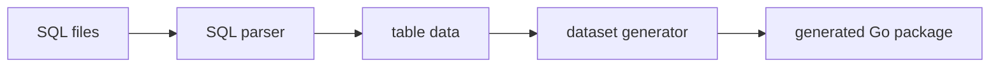

# mock-generator architecture

## Mapa interno

```text
tools/mock-generator/
|-- cmd/
|   `-- main.go
|-- docs/
|-- pkg/
|   |-- generator/
|   |-- parser/
|   `-- types/
|-- Makefile
|-- README.md
`-- CHANGELOG.md
```

## Activos principales

| Activo | Funcion |
| --- | --- |
| `cmd/main.go` | CLI con flags de directorio de entrada y salida |
| `pkg/parser` | extrae tablas, columnas y filas desde SQL |
| `pkg/generator` | materializa codigo Go |
| `pkg/types` | mapea nombres de tabla a nombres Go |

## Diagrama local



## Decisiones estructurales visibles

- La herramienta depende de convenciones muy concretas de SQL y nombres de tablas.
- El modulo no tiene hoy una carpeta de fixtures propia; depende de entradas externas.
